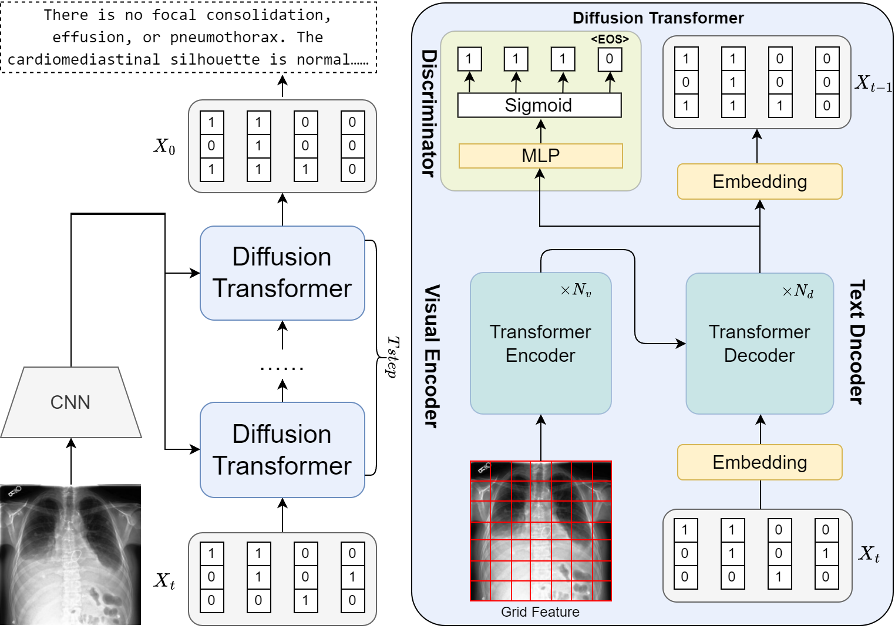

# D^2Net

## Introduction
this repository is for MPROVING RADIOLOGY REPORT GENERATION WITH D^2-NET: WHEN DIFFUSION MEETS DISCRIMINATOR. This is developed based on [SCD-Net](https://arxiv.org/abs/2212.03099).

## Run
All the shell scripts and config files are under /config folder.
The weights can be obtained through the following links:
    MIMIC-CXR: https://1drv.ms/u/s!AuoUHkPJ85GYkKlHUsT0l2Qjg1zHvw?e=lz12Qo
    IU X-Ray: https://1drv.ms/u/s!AuoUHkPJ85GYkYMqMyECje537c4yXg?e=TJ3C6a
## Acknowledgement
This code used resources from [X-Modaler Codebase](https://github.com/YehLi/xmodaler) and [bit-diffusion code](https://github.com/lucidrains/bit-diffusion). We thank the authors for open-sourcing their awesome projects.
## License
MIT
